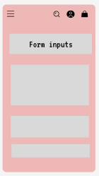
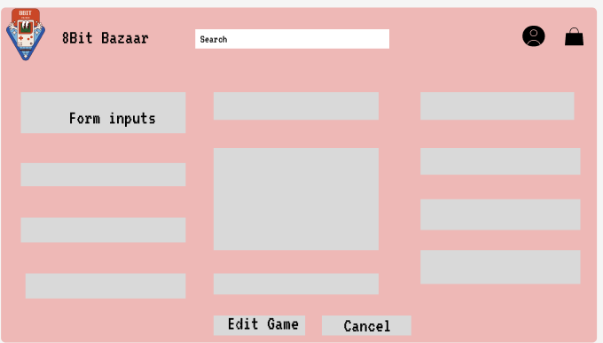
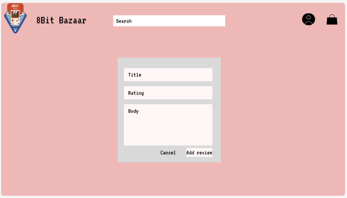
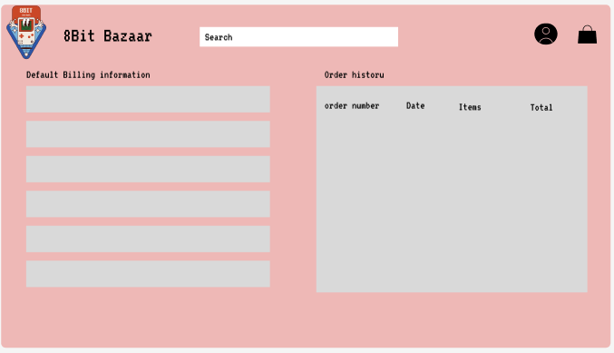

# 8Bit Bazaar

8Bit Bazaar is an online platform to byt retro and old school games. Users can buy and download games. 

 

### [Link to live site]()

## User Experience

### User Stories

I embraced the Agile methodology and made use of a GitHub project board to streamline the organization and development of my user stories. To improve clarity and structure, I crafted a template that meticulously details each user story. This template not only ensures precision but also contributes to a well-defined framework for effective project management.

Issues Template

Issues List

Project Board

### MoSCoW Prioritization

I used MoSCow priotitization to organise each iteration of my project

- **Must Have**: guaranteed to be delivered (*max 60% of stories*)
- **Should Have**: adds significant value, but not vital (*the rest ~20% of stories*)
- **Could Have**: has small impact if left out (*20% of stories*)
- **Won't Have**: not a priority for this iteration

#### Developer

As a **developer**, I can **create an entity relationship diagram** so that I can **plan my database models**.(ITERATION 1)(MUST HAVE)

    Acceptance Criteria:

    1. Use DrawSQL to plan database schema
    2. The ERD should accurately represent the relationships between different entities in the database, helping plan the overall structure and connections.
    3. The ERD should include essential details such as tables, primary and foreign keys, and relationships between entities, providing a clear visual representation for database modeling.

As a **developer**, I can **implement logic** so that I can **mark games as on sale, and the price is reduced**.(ITERATION 3)(SHOULD HAVE)

    Acceptance Criteria:

    1. The platform should provide a backend mechanism or interface that allows developers to mark specific games as "on sale."
    2. Once a game is marked as "on sale," the platform should dynamically update the displayed price to reflect the reduced, discounted price.
    3. Developers should have the flexibility to easily toggle the "on sale" status for games, allowing for seamless management of promotional periods and pricing changes.

As a **developer**, I can **create wireframes** so that I can **plan the appearance and structure of my site**.(ITERATION 2)(MUST 
 HAVE)

    Acceptance Criteria 

    1. Developers should have access to wireframing tools or resources to create visual representations of the website's appearance and structure.
    2. The wireframes should encompass key elements such as layout, navigation, and placement of essential components, providing a comprehensive plan for the site's design.
    3. The wireframes should serve as a reliable reference for the development team, aiding in the efficient implementation of the website's visual and structural elements.

As a **developer**, I can **create user stories** so that I can **plan my project**.(ITERATION 2)(MUST HAVE)

    Acceptance Criteria:

    1. Use GitHub projects for the creation, tracking, and management of user stories.
    2.  User stories should be clearly defined, outlining the intended functionality or feature from the user's perspective.
    3. Each user story should include acceptance criteria, specifying the conditions that must be met for the story to be considered complete.

As a **developer**, I can **add robots.txt , sitemap.xml file, descriptive meta tags and
rel attributes on links to external resources** so that I can **enhance SEO**.(ITERATION 7)(MUST HAVE)

    Acceptance Criteria:

    1. A robots.txt file is created and implemented to guide web crawlers on page indexing.
    2. A sitemap.xml file is generated and submitted to search engines for efficient content indexing.
    3. Descriptive meta tags, including title and meta descriptions, are added to key pages for improved search engine visibility.

As a **developer**, I can **test my code** so that I can **ensure everything works as it should**.(ITERATION 7)(MUST HAVE)

    Acceptance Criteria:

    1. The developer should conduct manual testing to evaluate the user interface, user experience, and overall functionality of the application.
    2. Automated tests, including unit tests and integration tests, should be implemented to ensure the correctness and stability of individual components and their interactions.
    3. End-to-end testing should be carried out, both manually and through automated tools, to validate the complete flow of the application and identify potential issues in a real-world scenario.

#### Admin

As an **admin**, I can **add games to the site** so that I can **update the catalog**.(ITERATION 4)(MUST HAVE)

    Acceptance Criteria

    1. The admin should have access to a user-friendly interface allowing them to add new games to the site.
    2.  The game addition process should include essential details such as title, description, cover image, price, and any relevant categorization.
    3. Once a game is added, it should seamlessly integrate into the site's catalog, ensuring it is visible to shoppers.

As an **admin**, I can **edit and delete games** so that I can **manage the store effectively**.

    ### Acceptance Criteria

    1. The admin should be able to access a user-friendly interface to edit existing game details, including title, description, cover image, price, and categorization.
    2. The editing process should ensure that changes made to a game are accurately reflected in the catalog, maintaining consistency across the platform.
    3. The admin should have the capability to delete games from the catalog, removing them from the site effectively.

#### Shopper

As a **shopper**, I can **view a list of games** so that I can **see which I would like to purchase**. (ITERATION 2)(MUST HAVE)

    Acceptance Criteria:

    1. Upon accessing the homepage, I should see a well-organized list of games with their titles, cover images, and prices, facilitating a quick overview.
    2. The list should be easily navigable, allowing me to scroll through and identify games of interest without any usability issues.
    3. Clicking on a game in the list should promptly redirect me to a detailed page providing additional information about the selected game, such as a description, reviews, and specifications.

As a **shopper**, I can **search for a game by name or description** so that I can **find the game I am looking for**.(ITERATION 3)(SHOULD HAVE)

    Acceptance Criteria:

    1. There should be a clearly visible search bar on the homepage, enabling me to input the name or a relevant description of the game I am looking for.
    2. Upon entering a search query, the platform should promptly display relevant results, including games with titles or descriptions matching the entered keywords.
    3. The search results should be presented in an easily comprehensible format, showcasing essential details such as game title, cover image, and price, allowing me to quickly identify and select the desired game.

As a **shopper**, I can **view the details of the game** so that I can **see the price, description, game play, rating and image**. (ITERATION 2)(SHOULD HAVE)

    Acceptance Criteria:

    1. Upon selecting a game, I should see a dedicated page with clear and prominently displayed pricing information.
    2. The game details page must provide a concise yet informative description, offering key insights into the game's features.
    3. The page should present any additional information, such as if it is on sale and associated reviews

As a **shopper**, I can **view different categories of games** so that I can **filter the ones I like**.(ITERATION 3)(MUST HAVE)

    Acceptance Criteria 

    1. The platform should display distinct categories of games on the homepage, allowing me to easily identify and access a variety of genres.
    2. Upon selecting a specific category, the list of games should dynamically update to showcase only those belonging to the chosen category.
    3. The category filter should be intuitive and user-friendly, enabling me to efficiently navigate through different genres and find games that align with my preferences.

As a **shopper**, I can **receive and email confirmation after registering ** so that I can **ensure my account was registered **.

    Acceptance Criteria: 

    1. Following the successful purchase of a game, the shopper should receive an email confirmation in their registered email inbox.
    2. The confirmation email should explicitly state that the purchase was successful, providing assurance that the transaction has been completed.
    3. The email content should include essential details such as a confirmation message, itemized list of purchased games, transaction summary, and any relevant information regarding accessing or downloading the games.

As a **shopper**, I can **receive email confirmations** so that I can **ensure my account was registered and purchases verified**.(ITERATION 4)(SHOULD HAVE)

    Acceptance Criteria:

    1. Upon successfully completing the account registration process, the shopper should receive a confirmation email in their registered inbox, clearly communicating that the registration was successful and providing assurance that their account is now active.
    2. Following a successful purchase, another email confirmation should be sent to the shopper's registered email inbox, explicitly stating that the purchase was successful and offering details such as a confirmation message, an itemized list of purchased items, transaction summary, and any relevant information regarding accessing or downloading the purchased content.
    3. The email content for both registration and purchase confirmations should be comprehensive, including necessary details and instructions, and designed to provide a seamless and reassuring user experience.

As a **shopper**, I can **view games in my bag** so that I can **see what I have added and make any adjustments before checkout**.(ITERATION 3)(MUST HAVE)

    Acceptance Criteria 

    1. The platform should have a clearly visible and easily accessible section where shoppers can view the games they have added to their shopping bag.
    2. The list of games in the shopping bag should display essential details such as titles, quantities, and prices, providing a concise overview for shoppers.
    3. Shoppers should have the ability to easily adjust the quantity of each game or remove items from their shopping bag, facilitating last-minute adjustments before proceeding to checkout.

As a **shopper**, I can **See the running total of my purchases** so that I can **avoid overspending**.(ITERATION 3)(SHOULD HAVE)

    Acceptance Criteria:

    1. The platform should display a running total prominently on the shopping page, allowing shoppers to see the accumulated cost of their selected items.
    2. The running total should dynamically update in real-time as shoppers add or remove items from their shopping bag, providing an accurate reflection of their current purchases.
    3. The running total should be clear and easily noticeable, helping shoppers to monitor and manage their spending throughout the shopping experience.

As a **shopper**, I can **see special offers** so that I can **take advantage of them**.(ITERATION 3)(SHOULD HAVE)

    Acceptance Criteria:

    1. A dedicated section for special offers should be prominently displayed on the platform's homepage, ensuring easy visibility for shoppers.
    2. Special offers must be presented with clear visuals, concise descriptions, and any applicable discounts or unique selling points.
    3. Shoppers should have the ability to click on each special offer to access more detailed information.

As a **shopper**, I can **easily login/ logout** so that I can **access my account information/ keep my account secure**.(ITERATION 1)(SHOULD HAVE)

    Acceptance Criteria:

    1. Shoppers should find a visible and easily accessible login button on the homepage for a quick login process.
    2. The login/logout process should be straightforward, requiring minimal steps for shoppers to access their account or log out securely.
    3. Once logged in, shoppers should have immediate access to their account information, ensuring a convenient and efficient user experience.

As a **shopper**, I can **checkout my bag** so that I can **purchase my items**.(ITERATION 3)(MUST HAVE)

    Acceptance Criteria

    1. A clearly visible and easily accessible "Checkout" button should be present on the shopping page for shoppers to proceed to the checkout process.
    2. Shoppers should be able to review the items in their bag, including titles, quantities, and prices, before initiating the checkout.
    3. The checkout process should be user-friendly, guiding shoppers through the necessary steps such as providing shipping information, selecting payment methods, and confirming the purchase.

As a **shopper**, I can **receive feedback on my actions** so that I can **feel secure and confident in choices**.(ITERATION 3)(MUST HAVE)

    Acceptance Criteria: 

    1. The platform should provide real-time feedback to shoppers when they perform actions such as adding items to the shopping bag, updating quantities, or completing a purchase.
    2. Feedback messages should be clear, concise, and displayed prominently, ensuring shoppers are informed about the outcome of their actions.
    3. In case of errors or issues during the shopping process, shoppers should receive informative error messages that guide them on how to resolve the issue.

As a **shopper**, I can **register for an account** so that I can **have a personal profile**.(ITERATION 3)(SHOULD HAVE)

    Acceptance Criteria

    1. The platform should feature a user-friendly and easily accessible registration process on the homepage or a dedicated registration page for shoppers.
    2. Shoppers should be able to provide necessary information such as a valid email address and password to create their account during the registration process.
    3. Upon successful registration, shoppers should receive a confirmation message or email, ensuring they are aware that their account has been created successfully.

As a **shopper**, I can **make a payment** so that I can **order and receive my games**.(ITERATION 4)(MUST HAVE)

    Acceptance Criteria:

    1. Shoppers should be guided through a secure and straightforward payment process, allowing them to provide necessary payment details such as credit card information or use alternative payment methods.
    2. The payment process should clearly communicate the total cost, including the prices of selected games, discount and any other fees. 
    3. Upon successful payment, shoppers should receive a confirmation message or email detailing the order, including a summary of purchased games, total cost, and any relevant order tracking information.

As a **shopper**, I can **have a personalized profile** so that I can **see my order history and save payment information**.(ITERATION 4)(MUST HAVE)

    Acceptance Criteria:

    1. Users should be able to create and access a personalized profile on the platform, providing details such as a username, password, and email address.
    2. Upon logging into their personalized profile, users should have easy access to their order history, displaying a comprehensive list of past purchases.
    3. Users should have the option to securely save and manage their payment information within their personalized profile for quicker and more convenient future transactions.

As a **shopper**, I can **add products to my wish list** so that I can **purchase at a later date**.(ITERATION 5)(COULD HAVE)

    Acceptance Criteria:

    1. Shoppers should have the option to add products to a wish list while browsing the platform.
    2. The wish list functionality should be easily accessible, allowing shoppers to add or remove items with minimal effort.
    3. Shoppers should be able to view their wish list at any time, providing a convenient way to monitor and manage items for potential future purchases.

As a **shopper**, I can **use a discount code** so that I can **make use of offers**.(ITERATION 5)(SHOULD HAVE)

    Acceptance Criteria 

    1. The platform should provide a clearly visible field during the checkout process where shoppers can input a discount code.
    2. Shoppers should be able to apply the discount code easily, with the platform validating and adjusting the total cost accordingly.
    3. If the discount code is valid, the platform should display the updated total cost, reflecting the applied discount.

As a **shopper**, I can **recover my password in case I forget it** so that I can **recover my account**.(ITERATION 4)(SHOULD HAVE)

    Acceptance Criteria 

    1. Users should have access to a "Forgot Password" feature on the login page or within their account settings.
    2. When initiating the password recovery process, users should receive a prompt to enter their registered email address.
    3. The platform should send a secure password reset link to the user's registered email address, allowing them to create a new password.

As a **shopper**, I can **sign up for a newsletter** so that I can **receive updates**.(ITERATION 6)(MUST HAVE)

    Acceptance Criteria 

    1. Shoppers should have the option to sign up for the newsletter, either during the account registration process or through a dedicated newsletter sign-up feature.
    2. The newsletter sign-up process should be user-friendly, requiring minimal information such as an email address.
    3. Shoppers who sign up for the newsletter should receive regular updates, promotions, and relevant information via email.

As a **shopper**, I can **explore the websites facebook page** so that I can **stay up to date with offers and new releases**.( ITERATION 7)(MUST HAVE)

    Acceptance Criteria:

    - The platform should provide a prominent and easily accessible link or button for shoppers to explore the website's Facebook page.
    - Shoppers should be able to access the Facebook page seamlessly, whether through an external link or an integrated social media feature.
    - The Facebook page should  feature updates on offers, promotions, and new releases, providing shoppers with timely and relevant information.

As a **shopper**, I can **see custom error pages** so that I can **know I have visited the wrong url and can navigate back to the home page**. (ITERATION 7)(SHOULD HAVE)

    Acceptance Criteria:

    1. In the event of encountering an incorrect or non-existent URL, the platform should display a custom error page.
    2. The custom error page should clearly communicate that the shopper has visited an incorrect URL or encountered an error, providing a user-friendly message.
    3. he custom error page should include a prominent link or button that allows shoppers to easily navigate back to the home page.

As a **shopper**, I can **view, add and edit reviews** so that I can **decide whether to buy a game, and provide feedback on games I have purchased**.(ITERATION 5)(SHOULD HAVE)

    Acceptance Criteria:

    1. Users should be able to view existing reviews for a game, providing insights into the experiences of other shoppers.
    2. Users should have the option to add a review to a game, including a rating and written feedback, contributing to the community's collective knowledge.
    3. The platform should allow users to edit their reviews, providing flexibility for users to update or refine their feedback over time.

## Design

### Colour Scheme

#eeb8b6 (Light Coral): Main background color for a nostalgic and warm feel.
#2d55a6 (Dark Blue): Accent color, evoking the classic gaming atmosphere.
#ca4727 (Rust Red): Highlight color, adding vibrancy and emphasis.
#ffffff (White): Text color for clarity and readability.
#000000 (Black): Also used for text color.
#f2e9df (Beige): Additional background color, enhancing contrast and visual appeal.
This color palette aims to capture the essence of retro gaming while providing a clean and visually engaging experience for users on the website.

This color palette aims to capture the essence of retro gaming while providing a clean and visually engaging experience for users on the website.

### Typography

I used Google Fonts to browse fonts that fit my theme. 

* [VT323](https://fonts.google.com/specimen/VT323) was used for all of the sites text as it is pixelated and enhances the retro theme throughout the website. 

* [Font Awesome](https://fontawesome.com) icons were used for the mobile navigation menu icons, and for buttons across the site.

### Wireframes

I used [Figma](https://www.figma.com/) to create the wireframes for this project.

* The desktop wireframes are tailored to the widely adopted screen resolution of 1920 x 1080, constituting 22.18% of screens.

* The tablet wireframes are designed to fit the dimensions of the iPad Pro (1024 x 1366).

* For mobile devices, the wireframes are crafted to the specifications of the iPhone SE, with dimensions set at 375 x 667.
#### Home Page

Click to view Home Page wireframes

#### Desktop

#### Tablet

#### Mobile

#### Sign Up Page

Click to view Sign Up Page wireframes

#### Desktop

#### Tablet

#### Mobile

#### Login Page

Click to view Login Page wireframes

#### Desktop

#### Tablet

#### Mobile

#### Logout Page

Click to view Logout Page wireframes

#### Desktop

#### Tablet

#### Mobile

#### Games Page

Click to view Games wireframes

#### Desktop

#### Tablet

#### Mobile

#### Game Details

Click to view Game Details wireframes

#### Desktop

#### Tablet

#### Mobile

#### Product management: Add game

Click to view add game wireframes

#### Desktop

#### Tablet

#### Mobile

#### Product management: Edit game

Click to view edit game wireframes

#### Desktop

#### Tablet

#### Mobile

#### Wishlist

Click to view the wishlist wireframes

#### Desktop

#### Tablet

#### Mobile

#### My reviews

Click to view the my reviews wireframes

#### Desktop

#### Tablet

#### Mobile

#### Add review

Click to view the add review wireframes

#### Desktop

#### Tablet

#### Mobile

#### Edit review

Click to view the edit review wireframes

#### Desktop

#### Tablet

#### Mobile

### Bag

Click to view the bag wireframes

#### Desktop

#### Tablet

#### Mobile

### Checkout

Click to view the checkout wireframes

#### Desktop

#### Tablet

#### Mobile

#### Checkout Success

Click to view the checkout success wireframes

#### Desktop

#### Tablet

#### Mobile

### Profile

Click to view the profile wireframes

#### Desktop

#### Tablet

#### Mobile

