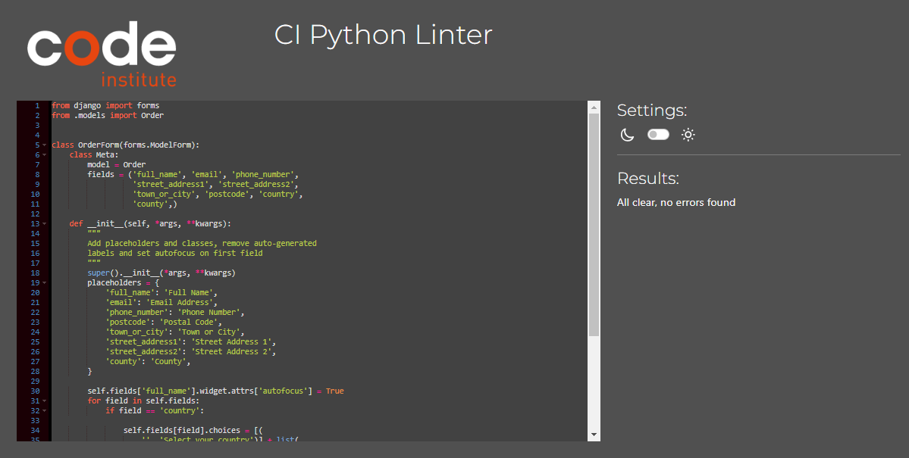
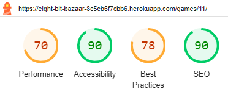

# Testing

## Code validation

### HTML

I used [HTML W3C Validator](https://validator.w3.org) to validate  of my HTML files.

Because my project uses Jinja syntax, I copied source data from each page and validated by input.

| Page | Screenshot | Notes |
| --- | --- | --- |
|Home | |Pass |
|Games| |Pass |
|Game Detail | |Pass |
|Edit Game | | Error with duplicate ID but this is due to how the form is rendered and I was unable to fix this issue.|
|Add Game | | Error with duplicate ID but this is due to how the form is rendered and I was unable to fix this issue.|
| Bag | |Pass |
| Checkout| |Pass |
| Checkout Success| |Pass |
| Profile | |Pass |
| Order history | |Pass |
| Wishlist | |Pass |
|  Reviews | |Pass |
| Add Review | |Pass |
| Edit Review | |Pass |
|Login | |Pass |
|Sign up|  |Pass |
|Logout  | |Pass |
|Password Reset  | |Pass |
|Password Reset Done  | |Pass |
|Password Change | |Pass |
|Privacy statement | | There are a large number of errors on this page due to the formatting by Termly. I did change these to prevent structure changes and for time constraint reasons |

### CSS

 CSS passed via direct input using the [CSS Jigsaw Validator](https://jigsaw.w3.org/css-validator) other than the errors show below:

The CSS shown was taken from [Code Pen](https://codepen.io/b1tn3r/pen/YjOzRv) and was provided as SCSS which I converted to CSS. I did not want to make any further changes to the code to prevent any disruption to functionality. 

### Javascript

| File | Screenshot | Notes |
| --- | --- | --- |
| buttons.js|  | No errors or warnings|
| stripe_elements.js|  | No errors or warnings|
| Update and delete quantity, delete modal and quantity input script|  | No errors or warnings|

### Python

I have used the [CI Python Linter](https://pep8ci.herokuapp.com) to validate my Python files.

| File | Screenshot | Notes |
| --- | --- | --- |
| settings.py |  | There are 4 errors that come from standard settings.py lines. It is advised not to edit them.|
| urls.py |  | Pass |
|Games admin.py |  | Pass |
|Games apps.py|  | Pass |
|Games forms.py|  | Pass |
|Games models.py|  | Pass |
|Games urls.py|  | Pass |
|Games views.py|  | Pass |
|Bag apps.py|  | Pass |
|Bag contexts.py|  | Pass |
|Bag urls.py|  | Pass |
|Bag views.py|  | Pass |
|Checkout admin.py |  | Pass |
|Checkout apps.py|  | Pass |
|Checkout forms.py|  | Pass |
|Checkout models.py|  | Pass |
|Checkout signals.py|  | Pass |
|Checkout urls.py|  | Pass |
|Checkout views.py|  | Pass |
|Home apps.py|  | Pass |
|Home urls.py|  | Pass |
|Home views.py|  | Pass |
|Profile apps.py|  | Pass |
|Profile forms.py|  | Pass |
|Profile models.py|  | Pass |
|Profile urls.py|  | Pass |
|Profile views.py|  | Pass |
|Wishlist apps.py|  | Pass |
|Wishlist models.py|  | Pass |
|Wishlist urls.py|  | Pass |
|Wishlist views.py|  | Pass |

## Lighthouse

| Page | Device | Screenshot|
| --- | --- | --- |
| Home  | Desktop |   |
| Home  | Mobile |   |
| Games  | Desktop |   |
| Games  | Mobile|   |
| Game Detail  | Desktop|   |
| Game Detail  | Mobile|   |
| Bag  | Desktop|   |
| Bag  | Mobile|   |
| Checkout | Desktop|   |
| Checkout | Mobile|   |
| Checkout Success | Desktop|   |
| Checkout Success | Mobile|   |
| Add game | Desktop|   |
| Add game| Mobile|   |
| Edit game | Desktop|   |
| Edit game| Mobile|   |
| Add review | Desktop|   |
| Add review| Mobile|   |
| Edit review | Desktop|   |
| Edit review| Mobile|   |
| My reviews | Desktop|   |
| My reviews | Mobile|   |
| Wishlist | Desktop|   |
| Wishlist | Mobile|   |
| Login | Desktop |   |
| Login | Mobile |   |
| Logout | Desktop |   |
| Logout | Mobile |   |
| Sign Up| Desktop |   |
| Sign Up| Mobile |   |
| Password reset| Desktop |   |
| Password reset | Mobile |  |
| Password reset done| Desktop |   |
| Password reset done| Mobile |   |
| Privacy Policy| Desktop |   |
| Privacy Policy | Mobile |   |

Note: Best practices should be higher, however it is reduced due to the presence of third party cookies due to Stripe.
Furthermore the SEO is not 100 on some pages because the custom styled Retro buttons are not crawlable.These are points to improve in future development of this site. 
## Manual Testing 

## Home Page

| User Action | Expected Result | Pass/Fail | Comments |
| --- | --- | --- | --- |
| Click on Logo | Redirects to Home Page | Pass | |
| Click on Shop Now button | Redirects to Games Page | Pass | |

## Games Page

| User Action | Expected Result | Pass/Fail | Comments |
| --- | --- | --- | --- |
| Click on All Games link in navbar | Redirects to Games Page | Pass | |
| Click on By Price link in navbar | Redirects to Games Page | Pass | Games sorted by price low to high |
| Click on By Rating link in navbar | Redirects to Games Page | Pass | Games sorted by rating high to low |
| Click on By Category link in navbar | Redirects to Games Page | Pass | Games sorted by Category with Category sorted A-Z |
| Click on Genre link in navbar | Provides Genre dropdown | Pass | Scrollable dropdown of genres provided |
| Click on specific Genre in genre dropdown | Redirects to Games Page | Pass | All games which contain the specific genre are shown |

## Game Detail Page

| User Action | Expected Result | Pass/Fail | Comments |
| --- | --- | --- | --- |
| Click on Keep Shopping button | Redirects to Games Page | Pass | |
| Click + button on quantity selector form | Quantity increases  | Pass | |
| Click - button on quantity selector form | Quantity decreases | Pass | |
| Click on the add to bag button| Selected quantity added to bag | Pass | |
| Click on the add to wishlist button | Game added to user's wishlist | Pass | |
| Click on review this game button | User taken to add review page | Pass | Only if user is logged in and has purchased game |

## Search

| User Action | Expected Result | Pass/Fail | Comments |
| --- | --- | --- | --- |
| Enter word into search bar that appears in at least one game's name or description | Redirects to Games Page | Pass | |
| Enter word into search bar that doesn't appear in any game's name or description | Redirects to Games Page | Pass | |

## Sign Up Page

| User Action | Expected Result | Pass/Fail | Comments |
| --- | --- | --- | --- |
| Click on Register button under account on nav menu | Redirects to Sign Up Page | Pass | |
| Enter valid email address | Field only accepts email address format | Pass | |
| Enter valid password (twice) | Field only accepts password format | Pass | |

## Sign In Page

| User Action | Expected Result | Pass/Fail | Comments |
| --- | --- | --- | --- |
| Click on the Login button under account on nav menu | Redirects to Login Page | Pass | |
| Enter valid email address | Field only accepts email address format | Pass | |
| Enter valid password | Field only accepts password format | Pass | |

## Logout Page

| User Action | Expected Result | Pass/Fail | Comments |
| --- | --- | --- | --- |
| Click Logout button | Redirects user to Logout Page | Pass | Confirms logout first
| Click Confirm Logout button | Redirects user to Home Page | Pass | |

## User Profile Page

| User Action | Expected Result | Pass/Fail | Comments |
| --- | --- | --- | --- |
| Click on the My Profile link under account on nav menu | Redirects to User Profile Page | Pass | Only visible for logged-in users
| Click Update Information button | Saves form contents as default information for the user | Pass | Default information is cleared if the form is submitted while blank
| Click Order Number for a previous order in Order History | Redirects user to the order confirmation page for that order | Pass | |

## Bag

| User Action | Expected Result | Pass/Fail | Comments |
| --- | --- | --- | --- |
| Click Bag icon in the main nav | Redirects user to Bag Page | Pass | Shows "Keep Shopping" if Bag is empty

## Checkout

| User Action | Expected Result | Pass/Fail | Comments |
| --- | --- | --- | --- |
| Click on Secure Checkout button in the basket | Redirects to Checkout Page | Pass | |
| Click Complete Order button without required fields filled out | Message informs the user that required fields need to be filled out | Pass | |

## Checkout Success Page

| User Action | Expected Result | Pass/Fail | Comments |
| --- | --- | --- | --- |
| Order completed | Redirects to Checkout Success Page | Pass | |
| Click "Checkout Latest Deals" button | Redirects user to Games Page | Pass | Only visible if the user comes to this page straight from order completion
| Click "Back to Profile" button | Redirects user to their Profile | Pass | Only visible if the user comes to this page from the order history list on their profile

## Add Games Page

| User Action | Expected Result | Pass/Fail | Comments |
| --- | --- | --- | --- |
| Click "Add New Game" link from Admin dropdown | Redirects admin to Add Game Page | Pass | Visible only if logged in as an admin
| Click Cancel button | Redirects admin to Games Page | Pass | |

## Edit Game Page

| User Action | Expected Result | Pass/Fail | Comments |
| --- | --- | --- | --- |
| Click edit icon on the game | Redirects user to Edit Game Page | Pass | User must be an admin to see the icon and access this page
| Click Cancel button | Redirects admin to Games Page | Pass | |

## Delete Game Page

| User Action | Expected Result | Pass/Fail | Comments |
| --- | --- | --- | --- |
| Click delete icon on the game | Redirects user to Delete Game Page | Pass | User must be an admin to see the icon and access this page
| Click Cancel button | Redirects admin to Game Detail Page for the selected game | Pass | |

## Add Review Page

| User Action | Expected Result | Pass/Fail | Comments |
| --- | --- | --- | --- |
| Click "Add New Review Post" link from Admin dropdown | Redirects admin to Add Review Page | Pass | Visible only if logged in and have purchased the game
| Click Cancel button | Redirects admin to Review Page | Pass | |

## Edit Review Page

| User Action | Expected Result | Pass/Fail | Comments |
| --- | --- | --- | --- |
| Click edit icon on the review post | Redirects user to Edit Review Post Page | Pass | User must be logged in and have purchased the specific game
| Click Cancel button | Redirects admin to Review Page | Pass | |

## My Reviews Page

| User Action | Expected Result | Pass/Fail | Comments |
| --- | --- | --- | --- |
| Click edit review on the review post | Redirects user to Edit Review Post Page | Pass | User must be logged in and have left at least one review
| Click delete review on the review post | Deletes the review | Pass | |

## Wishlist

| User Action | Expected Result | Pass/Fail | Comments |
| --- | --- | --- | --- |
| Click on "Remove from Wishlist" | Removes the game from the Wishlist and displays a success toast | Pass | |
| Click on "Add to Bag" button for a specific game | Game added to shopping bag | Pass | Increases quantity by 1 if the specific game is already in the Bag

## Footer

| User Action | Expected Result | Pass/Fail | Comments |
| --- | --- | --- | --- |
| Click Privacy Policy link in the footer | Redirects user to Privacy Policy Page | Pass | |
| Click the email link in the footer | Opens mail for the user to send an email | Pass | |
| Click on social media links | Opens respective social media websites | Pass | |

## Authentication and Authorization

| User Action | Expected Result | Pass/Fail | Comments |
| --- | --- | --- | --- |
| Click on Log In link in navbar| Redirection to Login page | Pass | |
| Click on Sign Up link in navbar | Redirection to Sign Up page | Pass | |
| Click on Privacy Policy link | Opens Privacy Policy page in a new tab | Pass | |
| Try to access an authenticated page when not logged in | Redirects user to login page | Pass | User is prompted to log in before accessing the page
| Try to access an admin page when not logged in | Redirects user to login page | Pass | User is prompted to log in as an admin before accessing the page

## User Story testing

| User Story | Pass/Fail | Comments |
|------------|-----------|----------|
| Developer - Create ER Diagram | Pass | |
| Developer - Implement Logic for Sale | Pass | |
| Developer - Create Wireframes | Pass | |
| Developer - Create User Stories | Pass | |
| Developer - Enhance SEO | Pass | |
| Developer - Test Code | Pass | |
| Admin - Add Games to Site | Pass | |
| Admin - Edit and Delete Games | Pass | |
| Shopper - View List of Games | Pass | |
| Shopper - Search for a Game | Pass | |
| Shopper - View Game Details | Pass | |
| Shopper - View Categories of Games | Pass | |
| Shopper - Receive Email Confirmation After Registering | Pass | |
| Shopper - Receive Email Confirmations | Pass | |
| Shopper - View Games in My Bag | Pass | |
| Shopper - See Running Total of My Purchases | Pass | |
| Shopper - See Special Offers | Pass | |
| Shopper - Easily Login/Logout | Pass | |
| Shopper - Checkout My Bag | Pass | |
| Shopper - Receive Feedback on My Actions | Pass | |
| Shopper - Register for an Account | Pass | |
| Shopper - Make a Payment | Pass | |
| Shopper - Have a Personalized Profile | Pass | |
| Shopper - Add Products to My Wish List | Pass | |
| Shopper - Use a Discount Code | Pass | |
| Shopper - Recover My Password | Pass | |
| Shopper - Sign Up for a Newsletter | Pass | |
| Shopper - Explore the Website's Facebook Page | Pass | |
| Shopper - See Custom Error Pages | Pass | |
| Shopper - View, Add, and Edit Reviews | Pass | |

## Bugs

The list of bugs can be found in my Git Hub project board.

### Fixed Bugs

| Bug | Resolution |
| --- | --- |
| Footer not sticking to the bottom of the page when there was not enough content to push it down  | Followed a Youtube tutorial and edited my css to ensure footer was always at the bottom  |
| The game detail page was not responsive on mobile | Used bootstrap adaptive classes to change column sizes for mobile  |
| Confirmation emails not sending| Moved code out of the webhook and into a separate view |
| The order total not showing in the confirmation email | Syntax error, changing fixed the issue |
| Adding game to wishlist showed the added to bag toast | Add custom login to toast so a normal success message is shown|
| Images not rendering| Incorrect file path fixed|
| Cannot delete game from wishlist | url was corrected |
| Order history did not show most recent purchases first | Order sorted correctly|
| Adding another copy of a game already in the bag did not show the toast | Added functionality to add message when a game that is already in the bag is added again|
| Genre filtering did not work | update all_games view to handle sorting correctly |
| Running total did not update on mobile | change grand_total to total |
| Checkout success did not load upon completing payment | Updated HTML structure |
| Stripe card element not loading | Spelling mistake in post load js |

### Remaining Bugs

| Bug |
| --- |
| The discounted price of games does not show on the checkout success receipt |
| Wishlist images are different sizes |
| Filtering games based on price does not take into account their discounted price |

